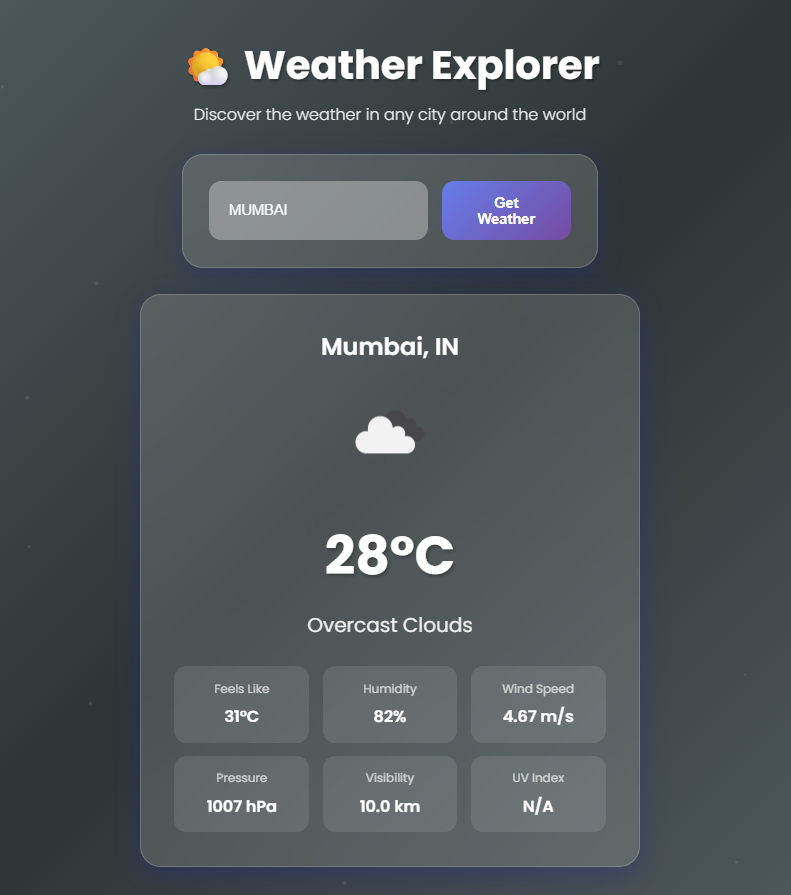

## 🌤️ Weather Explorer - Animated Weather Web App

**Weather Explorer** is a beautifully designed weather web application built using **HTML**, **CSS**, and **JavaScript**. It fetches real-time weather data from the **OpenWeatherMap API** and presents it in a sleek, animated, and responsive interface with dynamic backgrounds, floating particles, and smooth transitions.

---

## 🔥 Features

  - 🌍 Search for weather in any city around the world
  - 🌡️ Real-time display of:
  - Temperature
  - Feels Like
  - Humidity
  - Wind Speed
  - Pressure
  - Visibility
  - UV Index (placeholder for free plan)
  - 🎨 Animated dynamic backgrounds based on weather (sunny, rainy, snowy, cloudy)
  - 🧊 Glassmorphism UI with hover effects and transitions
  - ✨ Floating particle effects following mouse movement
  - 📱 Fully responsive for all screen sizes
  - 🔧 Error handling for invalid input and API issues

---

## 📷 Preview

---

## 🚀 Getting Started

### 1. Clone this Repository

``bash
git clone https://github.com/your-username/weather-explorer.git
cd weather-explorer

---

## 🗃️ Project Structure
weather-explorer/
├── index.html
├── style.css
├── script.js
├── README.md
└── preview.png (optional screenshot)

---

## 🧠 Future Improvements
  - Add 7-day or hourly weather forecast
  - Integrate geolocation for automatic city detection
  - Add dark/light theme toggle
  - Temperature unit switcher (°C/°F)
  - Save recent searches in localStorage

---

## ⚡ Tech Stack
  - HTML5
  - CSS3 with animations and transitions
  - Vanilla JavaScript (ES6+)
  - OpenWeatherMap API

---

## 📄 License

This project is licensed under the MIT License – feel free to use, modify, and share it for personal or educational purposes.

---

## 🙋‍♂️ Author

Created by [Sachin Kokare](https://github.com/sachinnnnnnn7)
If you like this project, consider giving it a ⭐ on GitHub!

---

